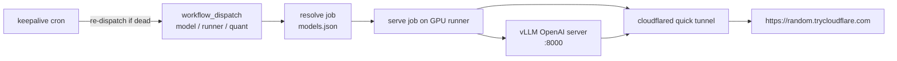

# llm-dee — LLM inference core engine on GitHub Actions + Cloudflare quick tunnel

Run any Hugging Face model through **vLLM** on a GitHub Actions runner and expose a
public **OpenAI-compatible endpoint** through a **Cloudflare quick tunnel** —
no Argo, no named tunnel, no Cloudflare account, no token.

Dispatch the workflow, pick a **model**, a **runner**, and a **quantization**
from the local [models.json](models.json) catalog, and get a
`https://<random>.trycloudflare.com` URL serving `/v1/chat/completions`.



## Quick start

1. **Fork / push this repo** to your GitHub account.
2. **Attach a self-hosted GPU runner** (Settings → Actions → Runners) with the
   labels `self-hosted,gpu` (add `gpu-large` for 14B+ models).
   GitHub-hosted runners have no GPU — a self-hosted runner is required.
3. *(Recommended)* set repo secrets:
   - `LLM_API_KEY` — bearer token required by the endpoint (without it the
     endpoint is **public and unauthenticated**).
   - `HF_TOKEN` — needed for gated repos (Llama, Gemma).
4. **Actions → "Run LLM (vLLM + Cloudflare quick tunnel)" → Run workflow**:
   choose model, quantization, TTL. The endpoint URL appears in the job
   summary within a few minutes.

```bash
curl https://<random>.trycloudflare.com/v1/chat/completions \
  -H "Content-Type: application/json" \
  -H "Authorization: Bearer $LLM_API_KEY" \
  -d '{"model": "qwen2.5-7b-instruct", "messages": [{"role":"user","content":"hi"}]}'
```

## Repository layout

| Path | Purpose |
|---|---|
| [models.json](models.json) | Model catalog: HF repos, quant variants, runner labels, vLLM tuning |
| [models.schema.json](models.schema.json) | JSON schema for the catalog |
| [.github/workflows/run-llm.yml](.github/workflows/run-llm.yml) | Core dispatch workflow (resolve → serve → tunnel → probe → TTL) |
| [.github/workflows/keepalive.yml](.github/workflows/keepalive.yml) | Cron that re-dispatches if the endpoint died |
| [.github/workflows/cleanup.yml](.github/workflows/cleanup.yml) | Cancels stale queued runs, prunes old caches |
| [.github/actions/resolve-model/action.yml](.github/actions/resolve-model/action.yml) | Composite action wrapping the resolver |
| [scripts/resolve_model.py](scripts/resolve_model.py) | Catalog → vLLM flags resolver |
| [scripts/serve.sh](scripts/serve.sh) | Installs pinned vLLM, starts server, waits for health, warms up |
| [scripts/start_tunnel.sh](scripts/start_tunnel.sh) | Pinned cloudflared quick tunnel + URL extraction + summary |
| [scripts/probe.sh](scripts/probe.sh) | External end-to-end probe through the tunnel |
| [scripts/stop.sh](scripts/stop.sh) | Best-effort cleanup |
| [scripts/warmup_runner.sh](scripts/warmup_runner.sh) | One-time runner prep + persistent HF cache |
| [scripts/validate_catalog.py](scripts/validate_catalog.py) | Catalog validation (CI / pre-commit) |
| [cloudflared/config.yml](cloudflared/config.yml) | Quick-tunnel config + notes for named tunnels |
| [examples/](examples/) | Python + curl clients |

## The model catalog

Everything is driven by [models.json](models.json). Each entry defines the HF
repo, the available quantization variants (each can point at a *different* HF
repo, e.g. `-AWQ`), runner labels, VRAM floor, and vLLM tuning:

```jsonc
"qwen2.5-7b-instruct": {
  "hf_repo": "Qwen/Qwen2.5-7B-Instruct",
  "runner_labels": ["self-hosted", "gpu"],
  "quantizations": {
    "bf16": { "repo": "Qwen/Qwen2.5-7B-Instruct", "dtype": "bfloat16" },
    "awq":  { "repo": "Qwen/Qwen2.5-7B-Instruct-AWQ", "quantization": "awq" }
  },
  "default_quantization": "awq",
  "max_model_len": 32768,
  "min_vram_gb": 6
}
```

Add your own model by copying a block — the dispatch dropdown is the
`options:` list in [run-llm.yml](.github/workflows/run-llm.yml), so add the key
there too. Validate with `python3 scripts/validate_catalog.py`.

## Robustness playbook (the "more ideas" section)

### 1. Keeping the runner / endpoint alive
- **TTL + keepalive chain**: GitHub caps job duration (6h hosted / ~5 days
  self-hosted). `run-llm.yml` runs for `ttl_minutes`; the
  [keepalive workflow](.github/workflows/keepalive.yml) checks every 10 min
  and re-dispatches automatically when nothing is active. Enable with repo
  variables `LLMDEE_KEEPALIVE_ENABLED=true`, `LLMDEE_KEEPALIVE_MODEL`,
  `LLMDEE_KEEPALIVE_QUANT`, `LLMDEE_KEEPALIVE_TTL`.
- **Concurrency group** (`llm-dee-<model>`) prevents two servers fighting over
  one GPU.
- **Crash detection**: the keep-alive loop watches both PIDs and fails fast
  with logs if vLLM or cloudflared dies.
- **Runner as a service**: install the runner with `svc.sh install` so it
  survives reboots; pair with keepalive for self-healing.

### 2. Auto-scale
- **Horizontal**: register N runners with the same `gpu` label; GitHub
  load-balances queued jobs across idle runners. Dispatch one run per model —
  the concurrency group keys per model, so different models run in parallel on
  different GPUs.
- **Queue-depth scaling (advanced)**: a small external controller can poll
  `GET /repos/{repo}/actions/runs?status=queued` and boot cloud GPU VMs that
  register themselves as ephemeral runners
  (`POST /repos/{repo}/actions/runners/registration-token`), then remove them
  when idle. This gives you EC2/Lambda/RunPod burst capacity.
- **vLLM-level**: pass `--max-num-seqs`, `--enable-prefix-caching`,
  `--enable-chunked-prefill` via `extra_args` to raise per-GPU throughput
  instead of adding GPUs.

### 3. Caching
- **Persistent HF cache on the runner**: `HF_HOME=/opt/llm-dee/hf-cache`
  survives between runs → warm starts in seconds. Prep once with
  `scripts/warmup_runner.sh <model_key> <quant>`.
- **GitHub Actions cache** (`actions/cache@v4`) backs up the HF cache keyed by
  repo+quant — helps ephemeral runners (10 GB limit, use for small models).
- **`HF_HUB_ENABLE_HF_TRANSFER=1`** for multi-gigabit weight downloads.
- **Prefix caching**: `--enable-prefix-caching` in `extra_args` for repeated
  system prompts.

### 4. Rest / reliability extras
- **Health probes**: internal `/health` wait + external probe through the
  tunnel before the endpoint is announced.
- **Log artifacts**: `vllm.log` + `cloudflared.log` uploaded on every run
  (`if: always()`).
- **Cleanup cron**: cancels stale queued runs and prunes caches older than 7d.
- **Catalog validation** runs before every dispatch and can be a pre-commit
  hook.
- **Pinned versions**: vLLM per model, cloudflared pinned — no surprise
  breakages from upstream releases.

### 5. Security hardening
- Always set `LLM_API_KEY` — quick tunnels are public URLs.
- For a **stable hostname + Zero Trust auth**, graduate to a *named* tunnel
  with Cloudflare Access (see [cloudflared/config.yml](cloudflared/config.yml)).
- Never commit weights or tokens; `.gitignore` already covers caches.

### 6. Even more ideas
- **Matrix dispatch**: fan out one dispatch across several models for A/B
  benchmarking (add a `strategy.matrix` variant workflow).
- **Nightly smoke test**: schedule `run-llm.yml` with the 0.5B model + probe
  to catch runner drift.
- **Metrics**: cloudflared exposes Prometheus metrics on `127.0.0.1:20000`;
  vLLM exposes `/metrics` — scrape both from the runner.
- **GGUF/CPU fallback**: add a `quantization: gguf` variant using
  `llama.cpp`'s server for CPU-only runners.
- **Discord/Slack webhook** step to post the fresh endpoint URL wherever your
  team hangs out.

## Notes & limits

- Quick-tunnel URLs are **ephemeral** — a new one every run. That's the price
  of "no Argo / no account". Use the keepalive chain + read the URL from the
  latest run's summary, or upgrade to a named tunnel for stability.
- GitHub ToS: don't use Actions as free production hosting. Self-hosted
  runners on your own hardware are the intended target here.
- The `resolve` job runs on `ubuntu-latest` (no GPU needed) so runner labels
  can be computed dynamically.

## License

MIT — see [LICENSE](LICENSE).
